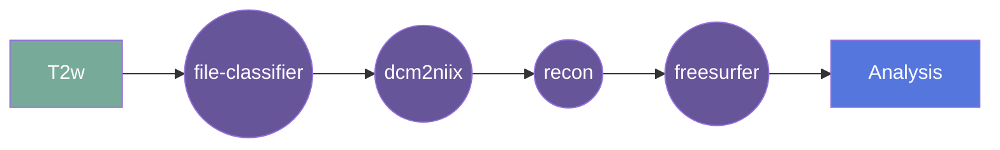

# VoluMetrcs
** Under Development **

This gear parses brain derivatives in a csv format and generates a report containing summary statistics and normative modelling.

## Overview

[Usage](#usage)

[FAQ](#faq)

### Summary
Currently this gear is designed to work with the recon-all-clinical gear. It takes the csv output from that gear and generates a PDF report.
The report contains summary statistics and normative modelling for the brain regions.

Future versions of this gear will be able to work with other csv files and generate reports for them.

### Cite
TBC

**license:**

**url:** <>

**cite:**  

### Classification

*Category:* analysis

*Gear Level:*

* [x] Project
* [ ] Subject
* [ ] Session
* [ ] Acquisition
* [ ] Analysis

----

### Inputs

* api-key
  * **Name**: api-key
  * **Type**: object
  * **Optional**: true
  * **Classification**: api-key
  * **Description**: Flywheel API key.

### Config

* input
  * **Base**: file
  * **Description**: input derivative csv file (currently recon-all-clinical)
  * **Optional**: false

### Outputs
* output
  * **Base**: file
  * **Description**: PDF report
  * **Optional**: false

#### Metadata

No metadata currently created by this gear

### Pre-requisites

- Preprocessed imaging data

#### Prerequisite Gear Runs

This gear runs on BIDS-organized data. To have your data BIDS-ified, it is recommended
that you run, in the following order:

1. ***dcm2niix***
    * Level: Any
2. ***file-metadata-importer***
    * Level: Any
3. ***file-classifier***
    * Level: Any
4. ***recon-all-clinical***
    * Level: Any

#### Prerequisite

## Usage

This section provides a more detailed description of the gear, including not just WHAT
it does, but HOW it works in flywheel

### Description

This gear is run at the `Project` level. It downloads the derived data for that project and then runs the
`VoluMetric` pipeline on it.

#### File Specifications

This section contains specifications on any input files that the gear may need

### Workflow

A picture and description of the workflow

Description of workflow

1. Upload data to container
2. Prepare data by running the following gears:
   1. file classifier
   2. dcm2niix
   3. Multi-Resolution Reconstruction (MRR) {for Hyperfine Swoop data}
3. Run the recon-all-clinical gear
4. VoluMetrics
   
### Use Cases

## FAQ

[FAQ.md](FAQ.md)

## Contributing

[For more information about how to get started contributing to that gear,
checkout [CONTRIBUTING.md](CONTRIBUTING.md).]
